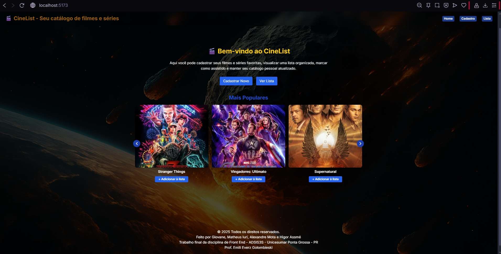

# 🎬 CineList

CineList é um catálogo interativo de filmes e séries desenvolvido como atividade avaliativa. Ele permite cadastrar, visualizar e marcar como assistido os títulos favoritos, com dados vindos da API da OMDb(caso sejam adicionados filmes a partir do carrosel) e de cadastros manuais. Tudo isso com visual moderno, carrossel interativo e foco em experiência de usuário!

---

# Funcionalidades principais

- ✅ Cadastro de filmes e séries manual ou via carrosel de filmes populares
- ✅ Listagem dos títulos com gênero, nota e sinopse.
- ✅ Marcar como assistido e fácil exclusão
- ✅ Carrossel interativo com sugestões populares
- ✅ Adição direta do carrossel para a lista
- ✅ Destaque automático ao clicar num filme já adicionado a partir do carrossel
- ✅ Armazenamento local das informações
- ✅ Interface responsiva
- ✅ Navegação entre páginas com botão de "Voltar" e menu de navegação.

---

#  Tecnologias usadas

- React + Vite
- Tailwind CSS
- React Router DOM
- React Slick (carrossel)
- OMDb API (dados dos filmes)
- LocalStorage 

---

---

#  Requisitos atendidos (atividade)

- [x] Projeto SPA com React
- [x] Múltiplas páginas: Home, Cadastro, Lista
- [x] Uso de API externa (OMDb)
- [x] Manipulação de dados no LocalStorage
- [x] Estilização com Tailwind CSS
- [x] HTML semântico com componentes estruturados
- [x] Carrossel funcional com biblioteca externa
- [x] Funcionalidade dinâmica (destaque, scroll automático, etc.)

---

🛠️ Como rodar o projeto do zero (passo a passo)

📦 Requisitos básicos (instalação única)
Antes de rodar o projeto, instale o seguinte:

🔹 1. Node.js (versão recomendada: v18 LTS ou superior)
- Baixe e instale pelo site: https://nodejs.org/
- Para verificar se está instalado:
    node -v
    npm -v

🔹 2. Git
- Usado para clonar o repositório e gerenciar o versionamento
- Baixe e instale pelo site: https://git-scm.com/
- Após instalar, verifique:
    git --version

📁 Clonando o repositório

    git clone https://github.com/SEU_USUARIO/catalogo-filmes-series.git
    cd catalogo-filmes-series

🔧 Instalando dependências

Este projeto usa React + Vite com as seguintes versões principais:

| Pacote             | Versão usada |
|--------------------|--------------|
| react              | ^18.x        |
| react-dom          | ^18.x        |
| react-router-dom   | ^6.x         |
| react-slick        | ^0.29.x      |
| slick-carousel     | ^1.8.x       |
| tailwindcss        | ^3.x         |
| vite               | ^4.x ou ^5.x |

Agora instale os pacotes com:

    npm install

▶️ Rodando o projeto

    npm run dev

Após iniciar, acesse no navegador:
http://localhost:5173

🧠 Dica: se der erro com Tailwind
Caso esteja com problemas no CSS, certifique-se de que os arquivos tailwind.config.js e postcss.config.js estão presentes e corretos. Depois disso, reinicie o servidor (Ctrl+C e npm run dev de novo).
